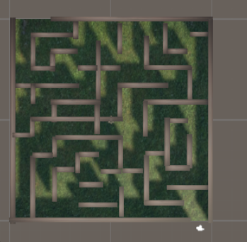

# 🎮 Mon Projet Unity

## 📌 Description
Ceci est un jeu développé avec Unity.  
Un jeu de plateforme où le joueur doit éviter des obstacles et atteindre la fin du niveau.

## 🚀 Fonctionnalités
- Gestion des déplacements du joueur
- Système de score
- Menu principal et options

## 🖼️ Captures d’écran
Voici quelques images du projet :  

### Menu


### Gameplay


## 🔧 Installation
1. Cloner le projet :
   ```bash
   git clone https://github.com/tonpseudo/MonProjetUnity.git
